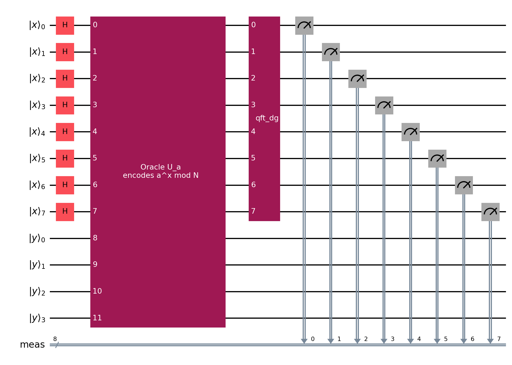
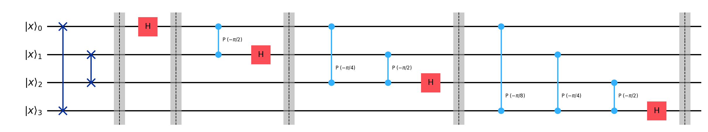
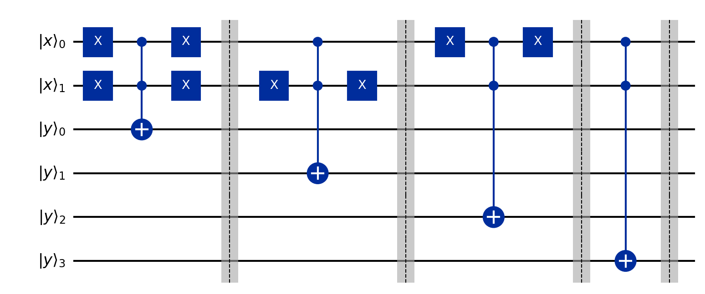

# Circuit Diagrams

This file explains the circuit diagrams generated by the repository. It keeps one drawing for each concept:

- the high-level Shor period-finding circuit
- the inverse QFT gate decomposition
- a small explicit XOR-oracle decomposition

The oracle decomposition is intentionally tiny. It shows how an oracle can be built from controlled bit flips for a small displayed input register; it is not a scalable modular exponentiation circuit.

## Generating Diagrams

Generate the standard circuit diagram set with:

```bash
python examples/circuit_diagrams_example.py --N 15 --a 2
```

or call the module directly:

```bash
python -m src.quantum_part.circuit_diagrams --N 15 --a 2 --output-dir images
```

This creates:

- `images/period_finding_circuit_N=15_a=2.png`
- `images/inverse_qft_decomposition_4_qubits.png`
- `images/oracle_decomposition_N=15_a=2_xqubits=2.png`

The older compatibility command still regenerates the compact circuit used in the README:

```bash
python src/quantum_part/quantum_circuit.py
```

## Register Layout

For an input `N`, the simulator uses:

```text
n = ceil(log2(N))
period register:  2n qubits
function register: n qubits
```

The period register needs about `N^2` basis states so continued fractions can recover the period from measured values `c / Q`.

For `N = 15`:

```text
n = 4
period register = 8 qubits
function register = 4 qubits
total = 12 qubits
```

## High-Level Period-Finding Circuit

The high-level circuit has four stages:

1. Apply Hadamard gates to the period register.
2. Apply the modular exponentiation oracle.
3. Apply inverse QFT to the period register.
4. Measure the period register.



This diagram is the main circuit-level view of Shor period finding. The oracle is drawn as one labeled block because a full gate-level modular exponentiation circuit would be much larger than the rest of the diagram.

## Hadamard Layer

The period register starts in `|0⟩`. Applying Hadamards creates:

```text
(1 / sqrt(Q)) sum_x |x⟩|0⟩
```

This is the equal superposition over all candidate exponents `x`. In the high-level diagram, this is the row of `H` gates at the start of the period register.

## Inverse QFT Gate Composition

The inverse QFT acts only on the period register. It converts periodic structure in the amplitudes into peaks in the measured first-register states.

Likely measurements satisfy:

```text
c / Q ~= s / r
```

where `r` is the period and `s` is an integer.

The diagram below expands a 4-qubit inverse QFT into swaps, controlled phase rotations, and Hadamard gates:



The full simulator may use more first-register qubits. This 4-qubit drawing is included because the gate pattern is readable and scales by repeating the same controlled-phase structure.

## Explicit Oracle Gate Composition

The oracle encodes:

```text
f(x) = a^x mod N
```

The matrix-mode oracle uses the reversible XOR form:

```text
|x⟩|y⟩ -> |x⟩|y xor (a^x mod N)⟩
```

For a tiny displayed exponent register, this can be decomposed as a truth table. For each displayed `x`, the circuit toggles the output bits that are `1` in `a^x mod N`, using multi-controlled X gates.

For `N=15`, `a=2`, and a 2-qubit displayed exponent register:

```text
x = 0 -> 2^0 mod 15 = 1  -> toggle output bit 0
x = 1 -> 2^1 mod 15 = 2  -> toggle output bit 1
x = 2 -> 2^2 mod 15 = 4  -> toggle output bit 2
x = 3 -> 2^3 mod 15 = 8  -> toggle output bit 3
```



This is an explicit gate composition, but only for the small displayed truth table. The full Shor modular exponentiation oracle for large registers would require a much more elaborate arithmetic circuit.

## Matrix Mode and Distribution Mode

Both simulator modes correspond to the high-level period-finding circuit.

- `mode="matrix"` explicitly materializes the simulated Hadamard, oracle, and IQFT matrices. This is useful for tiny cases.
- `mode="distribution"` computes the ideal first-register probability distribution directly. It does not execute a Qiskit circuit or materialize the full matrices.

The separate matrix/distribution block diagrams are not repeated here because they differ mostly in labels and qubit count. The important structural circuit is the high-level period-finding diagram above.

## References

- [IBM Quantum: quantum circuit model](https://quantum.cloud.ibm.com/docs/en/api/qiskit/circuit)
- [IBM Quantum: circuit library](https://quantum.cloud.ibm.com/docs/guides/circuit-library)
- [Qiskit `QFTGate` API](https://quantum.cloud.ibm.com/docs/en/api/qiskit/qiskit.circuit.library.QFTGate)
- [Qiskit `circuit_drawer` API](https://quantum.cloud.ibm.com/docs/en/api/qiskit/qiskit.visualization.circuit_drawer)
- [IBM Quantum Learning: Shor's algorithm](https://quantum.cloud.ibm.com/learning/en/courses/fundamentals-of-quantum-algorithms/phase-estimation-and-factoring/shor-algorithm)
