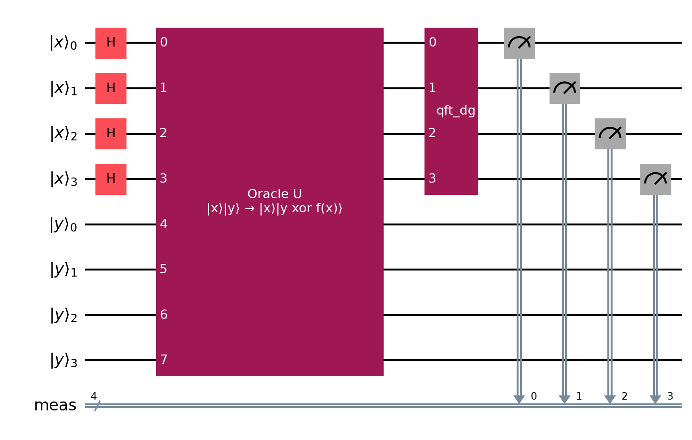
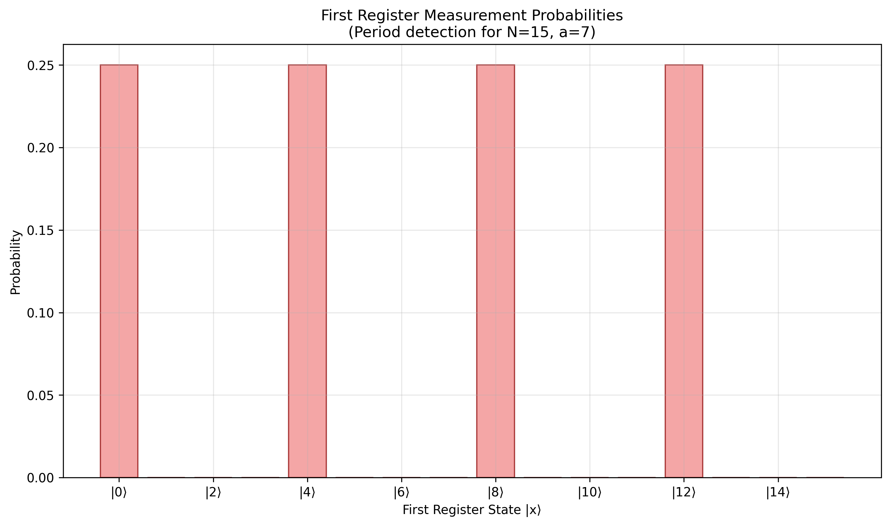

# Classical Simulation of Shor's Algorithm

A pure Python implementation of Shor's quantum factorization algorithm using classical matrix operations to simulate quantum circuits.
This project demonstrates the core concepts of Shor's algorithm without relying on quantum computing frameworks like Qiskit.

# Table of Contents

1. [Overview](#overview)
2. [Algorithm Steps](#algorithm-steps)
3. [Features](#features)
4. [Installation](#installation)
5. [Example Usage](#example-usage)
6. [Limitations](#limitations)
7. [Project Structure](#project-structure)
8. [Educational Resources](#educational-resources)
9. [Acknowledgments](#acknowledgments)

## Overview

Shor's algorithm is a quantum algorithm that efficiently finds the prime factors of large integers, which forms the basis for breaking RSA encryption.
This implementation simulates the quantum operations classically, to illustrate how the algorithm works step-by-step in exponential $O(2^n)$ time, where $n$ is the total number of qubits required.

See [THEORY.md](https://github.com/SidRichardsQuantum/Shors_Algorithm_Simulation/blob/main/THEORY.md) for a descriptive algorithm walkthrough.

## Algorithm Steps

1. **Input Validation**: Takes a semiprime and checks it isn't even or a perfect square
2. **Quantum Register Setup**: Creates two qubit registers
3. **Equal Superposition**: Applies Hadamard gates to the first register to create quantum superposition with equal amplitudes
4. **Modular Exponentiation**: Implements an oracle unitary matrix to entangle the registers
5. **IQFT**: Applies an Inverse Quantum Fourier Transform matrix to extract period information
6. **Period Finding**: Analyzes measurement probabilities to determine period
7. **Classical Post-Processing**: Uses the period to calculate prime factors

A quantum circuit for Shor's Algorithm using 8 qubits (only utilisation of qiskit in this project):



## Features

- **Pure Python Implementation**: No quantum computing libraries required
- **Educational Focus**: Clear step-by-step implementation with detailed comments
- **Visualization**: Plots probability distributions to visualize quantum measurements
- **Runtimes**: Graph of code runtime to show the exponential nature of this classical simulation

## Installation

```bash
git clone https://github.com/SidRichardsQuantum/Shors_Algorithm_Simulation
cd Shors_Algorithm_Simulation
pip install -r requirements.txt
```

## Example Usage

**Terminal input**:

```python
python src/examples/example_15.py
```

**Output**:

```
N = 15
Running Classical Checks...
Classical checks passed.
a = 7.
Proceeding to quantum algorithm...
The period r = 4 is even.
a^(r/2) + 1 = 5, and gcd(5, 15) = 5
a^(r/2) - 1 = 3, and gcd(3, 15) = 3
The factors of N = 15 are 5 and 3.
```
This also saves the plot to the "images" directory as "first_register_probabilities_N=15_a=7.png":



## Limitations

- **Exponential Memory**: Classical simulation runtime is $O(exp(√(log N)))$ (sub-)exponential for factorisation problems
- **Small Numbers Only**: Practical for factoring small integers ($N < 300$) using few qubits
- **Educational Purpose**: Not suitable for large numbers practically used for RSA
- **Multiple Runs**: May require multiple runs if classical checks on $N, a$ or $r$ fail

## Project Structure

```
Shors_Algorithm_Simulation
├── LICENSE                       # Project license
├── requirements.txt              # Python dependencies
├── README.md                     # This file
├── THEORY.md                     # Theoretical background
├── main.py                       # Main execution script
├── examples/                     # Example usage and demonstrations
│   ├── __init__.py
│   ├── example_15.py             # Default example
│   └── runtimes_test.py          # Runtime performance testing
├── images/                       # Generated visualizations of examples
└── src/                          # Source code
    ├── __init__.py               # Main package initialization
    ├── classical_parts/          # Classical algorithm components
    │   ├── __init__.py
    │   ├── pre_checks.py         # Pre-quantum validation
    │   └── post_checks.py        # Post-quantum validation
    ├── plots_and_period/         # Visualization and period finding
    │   ├── __init__.py
    │   ├── find_period.py        # Period finding function
    │   ├── probability_plot.py   # Probability visualization
    │   └── runtime_plot.py       # Runtime analysis plots
    └── quantum_part/             # Quantum operators
        ├── __init__.py
        ├── hadamard_matrix.py    # Hadamard gate implementation
        ├── oracle_matrix.py      # Modular exponentiation oracle
        ├── iqft_matrix.py        # Inverse QFT implementation
        └── run_quantum_gates.py  # Quantum circuit execution
```

## Educational Resources

- [Shor's Algorithm Explained](https://en.wikipedia.org/wiki/Shor%27s_algorithm)
- [Quantum Fourier Transform](https://qiskit.org/textbook/ch-algorithms/quantum-fourier-transform.html)
- [Period Finding and Factorization](https://docs.microsoft.com/en-us/quantum/concepts/algorithms)

## Acknowledgments

This implementation is inspired by the original work of Peter Shor and serves as an educational tool for understanding quantum algorithms through classical simulation.

---

**Note**: This is a classical simulation for educational purposes.
Real quantum advantage requires actual quantum hardware that can efficiently implement this factorisation algorithm in $O((log(N))^3)$) polynomial time.

---

📘 Author: [Sid Richards]

 LinkedIn: [https://www.linkedin.com/in/sid-richards-21374b30b/]

This project is licensed under the MIT License - see the [LICENSE](LICENSE) file for details.
