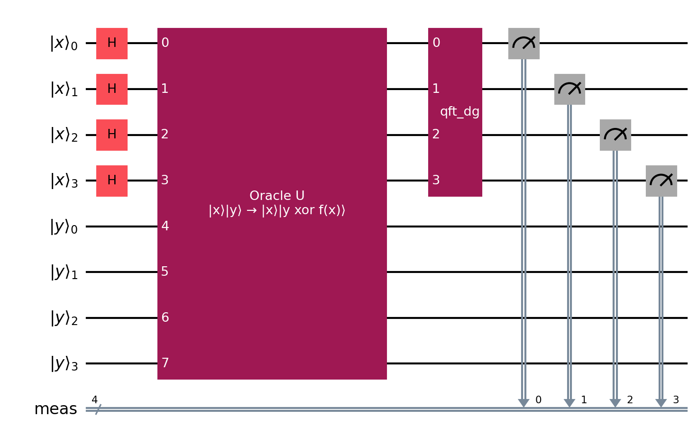

# Classical Simulation of Shor's Algorithm

<p align="center">

<a href="https://pypi.org/project/shors-algorithm-simulation/">

</a>

<a href="pyproject.toml">
=3.10">
</a>

<a href="https://github.com/SidRichardsQuantum/Shors_Algorithm_Simulation/actions/workflows/tests.yml">

</a>

<a href="https://SidRichardsQuantum.github.io/Shors_Algorithm_Simulation/">

</a>

<a href="LICENSE">

</a>

<a href="https://github.com/sponsors/SidRichardsQuantum">

</a>

</p>

**Project website:** [https://SidRichardsQuantum.github.io/Shors_Algorithm_Simulation/](https://SidRichardsQuantum.github.io/Shors_Algorithm_Simulation/)

**PyPI:** [https://pypi.org/project/shors-algorithm-simulation/](https://pypi.org/project/shors-algorithm-simulation/)

A pure Python implementation of Shor's quantum factorization algorithm using classical simulation of the period-finding step.
The project supports both explicit matrix simulation for very small inputs and a faster distribution-based simulation for the ideal first-register measurement probabilities.

## Table of Contents

1. [Overview](#overview)
2. [Algorithm Steps](#algorithm-steps)
3. [Features](#features)
4. [Project Structure](#project-structure)
5. [Installation](#installation)
6. [Example Usage](#example-usage)
7. [Limitations](#limitations)
8. [References](#references)
9. [Acknowledgments](#acknowledgments)

### Overview

Shor's algorithm is a quantum algorithm that efficiently finds the prime factors of large integers, which forms the basis for breaking RSA encryption.
This implementation simulates the quantum operations classically to illustrate how Shor's algorithm works step by step. `mode="matrix"` explicitly applies the simulated gates and grows exponentially in memory; `mode="distribution"` computes the same ideal first-register probability distribution without materializing the full matrices.

See the [theory walkthrough](https://SidRichardsQuantum.github.io/Shors_Algorithm_Simulation/theory.html) for a descriptive algorithm walkthrough.

See the [circuit walkthrough](https://SidRichardsQuantum.github.io/Shors_Algorithm_Simulation/circuits.html) for the register and circuit-diagram walkthrough.

See the [results page](https://SidRichardsQuantum.github.io/Shors_Algorithm_Simulation/results.html) for results and conclusions.

### Algorithm Steps

1. **Input Validation**: Takes a semiprime and checks it isn't even or a perfect square
2. **Quantum Register Setup**: Creates a period register of size `Q ~= N^2` and a function register large enough to store values modulo `N`
3. **Equal Superposition**: Applies Hadamard gates to the first register to create quantum superposition with equal amplitudes
4. **Modular Exponentiation**: Encodes `a^x mod N` in a reversible oracle to entangle the registers
5. **IQFT**: Applies an Inverse Quantum Fourier Transform matrix to extract period information
6. **Period Finding**: Uses continued fractions on high-probability measurements to recover and validate period candidates
7. **Classical Post-Processing**: Uses the period to calculate prime factors

A quantum circuit sketch for Shor's Algorithm using 8 qubits:



### Features

- **Pure Python Implementation**: No quantum computing libraries required for the simulator
- **Circuit Drawing**: Uses Qiskit to generate the illustrative circuit diagram
- **Educational Focus**: Clear step-by-step implementation with detailed comments
- **Visualization**: Plots probability distributions to visualize quantum measurements
- **Period-Finding Diagnostics**: Plots oracle periodicity, marked IQFT peaks, continued-fraction candidates, and mode comparisons
- **Runtimes**: Graph of code runtime to show the exponential nature of this classical simulation
- **Sampled Measurements**: Optional `shots` sampling draws stochastic first-register measurements from the ideal distribution
- **Retry Orchestration**: `max_attempts` can try multiple bases when `a` is not provided
- **Two Period-Finding Modes**:
  - `mode="distribution"` computes the ideal first-register measurement distribution directly, using the standard `Q ~= N^2` period register size.
  - `mode="matrix"` explicitly applies the simulated Hadamard, oracle, and IQFT matrices for very small inputs.

### Project Structure

```
Shors_Algorithm_Simulation
├── LICENSE                       # Project license
├── CHANGELOG.md                  # Release history
├── MANIFEST.in                   # Source distribution file manifest
├── pyproject.toml                # Package metadata and tool configuration
├── requirements.txt              # Python dependencies
├── requirements-circuits.txt     # Optional circuit-rendering dependencies
├── README.md                     # This file
├── CIRCUITS.md                   # Circuit diagram walkthrough
├── THEORY.md                     # Theoretical background
├── RESULTS.md                    # Results, conclusions and evaluations
├── main.py                       # Compatibility CLI shim
├── examples/                     # Example usage and demonstrations
│   ├── __init__.py
│   ├── benchmark_runtime.py      # Save runtime benchmark table
│   ├── circuit_diagrams_example.py # Generate Qiskit circuit diagrams
│   ├── factorisation_example.py  # Single deterministic run with saved plot
│   ├── no_plot_example.py        # Deterministic run without displaying plots
│   ├── multiple_cases_example.py # Run several (N, a) examples without plots
│   ├── shots_sweep_example.py    # Success rate vs sampled measurement shots
│   ├── visualizations_example.py # Generate educational period-finding plots
│   └── runtimes_test.py          # Runtime performance testing
├── images/                       # Generated visualizations of examples
├── tests/                        # Regression tests
└── shors_algorithm_simulation/   # Source package
    ├── __init__.py               # Public API exports
    ├── cli.py                    # argparse and human-readable output
    ├── core.py                   # Typed core API without CLI printing
    ├── probabilities.py          # Ideal distributions and sampled measurements
    ├── period.py                 # Continued-fraction period recovery
    ├── validation.py             # Classical input and factor checks
    ├── plotting/                 # Visualization helpers
    │   ├── __init__.py
    │   ├── diagnostics.py        # Educational diagnostics and comparison plots
    │   ├── formatting.py         # Plot label formatting
    │   ├── matplotlib_helpers.py # Shared matplotlib compatibility helpers
    │   ├── probabilities.py      # Probability visualization
    │   └── runtime.py            # Runtime analysis plots
    └── quantum/                  # Quantum operators and optional diagrams
        ├── __init__.py
        ├── circuits.py           # Reusable Qiskit circuit diagram builders
        ├── gates.py              # Quantum circuit execution
        ├── hadamard.py           # Hadamard gate implementation
        ├── iqft.py               # Inverse QFT implementation
        ├── oracle.py             # Modular exponentiation oracle
        └── quantum_circuit.py    # Compatibility circuit diagram entry point
```

### Installation

```bash
python -m pip install shors-algorithm-simulation
```

The PyPI install command applies after the first published release.

For development from source:

```bash
git clone https://github.com/SidRichardsQuantum/Shors_Algorithm_Simulation
cd Shors_Algorithm_Simulation
python -m pip install -e ".[test]"
```

Circuit diagram generation uses optional Qiskit dependencies:

```bash
python -m pip install ".[circuits]"
```

### Example Usage

**Terminal inputs**:

```bash
python -m examples.factorisation_example   # single run with plot output
python -m examples.no_plot_example         # single run without plotting
python -m examples.multiple_cases_example  # batch of small deterministic cases
python -m examples.shots_sweep_example     # plot success rate vs sampled shots
python -m examples.visualizations_example  # generate educational diagnostic plots
python -m examples.circuit_diagrams_example --N 15 --a 2
```

**Command-line usage**:

```bash
shors-sim --N 35 --a 2 --mode distribution --plots --output-dir images
shors-sim --N 15 --a 2 --mode matrix --json
shors-sim --N 21 --a 2 --shots 1024 --seed 1 --json
shors-sim --N 33 --max-attempts 5 --seed 0
```

`python main.py ...` is kept as a compatibility entry point for running from a source checkout.

Visualization plots can also be selected from the command line:

```bash
python -m examples.shots_sweep_example --N 21 --a 2 --shots 16 32 64 128 256 --trials 20
python -m examples.visualizations_example --N 35 --a 2 --plots oracle marked continued
python -m examples.visualizations_example --plots comparison --comparison-N 15 --comparison-a 2
```

Circuit diagrams can be generated from the command line:

```bash
python -m examples.circuit_diagrams_example --N 15 --a 2 --output-dir images
python -m shors_algorithm_simulation.quantum.circuits --N 35 --a 2
```

**Programmatic mode selection**:

```python
from shors_algorithm_simulation import shors_simulation

result = shors_simulation(N=21, a=2, mode="distribution")
print(result["success"], result["factors"], result["period"])

matrix_result = shors_simulation(N=15, a=2, mode="matrix")
print(matrix_result["success"], matrix_result["factors"], matrix_result["period"])

sampled_result = shors_simulation(N=21, a=2, shots=1024, random_seed=1)
print(sampled_result["measurement_counts"])

retry_result = shors_simulation(N=33, max_attempts=5, random_seed=0)
print(retry_result["success"], len(retry_result["attempts"]))
```

`distribution` mode is the default and is appropriate for the documented examples. `matrix` mode is intended for the smallest cases because explicit gate matrices grow quickly.
`shors_simulation` returns a dictionary containing `success`, `N`, `a`, `mode`, `period`, `factors`, `message`, `classical_precheck`, `shots`, `measurement_counts`, and `attempts`.

**Output**:

```
N = 35
Attempt 1: a = 2
The period r = 12 is even.
a^(r/2) + 1 = 30, and gcd(30, 35) = 5
a^(r/2) - 1 = 28, and gcd(28, 35) = 7
The factors of N = 35 are 5 and 7.
```
This also saves the plot to the "images" directory as "first_register_probabilities_N=35_a=2.png":


### Visualizations

`examples/visualizations_example.py` generates:

- oracle period pattern: `x -> a^x mod N`
- first-register probabilities with expected period peak markers
- continued-fraction candidate plot and CSV table
- matrix mode vs distribution mode comparison for a small case

`examples/shots_sweep_example.py` repeats sampled period recovery for multiple shot counts and saves a CSV plus a success-rate plot. It is intended to show how empirical measurement histograms converge toward the ideal distribution as shots increase.

### What Is Simulated

`mode="matrix"` constructs the full simulated state evolution for tiny examples, so it is useful for checking the gate-level model but grows quickly.
`mode="distribution"` computes the ideal post-IQFT first-register probability distribution directly from the periodic oracle values. It does not build a scalable quantum computer or simulate hardware noise.
When `shots` is provided, the simulator samples measurement counts from that ideal distribution and then runs the same continued-fraction recovery on the empirical histogram.

### Tests

```bash
python -m pytest -q
ruff check .
black --check .
```

Releases are published to PyPI by GitHub Actions trusted publishing when a GitHub Release is published with a tag matching the version in `pyproject.toml`.

### Limitations

- **Exponential Runtime/Memory**: `mode="matrix"` scales exponentially with the number of simulated qubits and is only practical for tiny cases.
- **Distribution Mode Is Idealized**: `mode="distribution"` avoids full matrices by computing the ideal first-register distribution directly, which is still a classical simulation of the period-finding output.
- **Shot Sampling Is Synthetic**: `shots` samples from the ideal distribution; it does not model device noise, decoherence, or imperfect gates.
- **Small Numbers Only**: Practical for factoring small educational examples, not cryptographic integers.
- **Educational Purpose**: Not suitable for large numbers practically used for low-bit RSA
- **Multiple Runs**: May require multiple runs if classical checks on $N, a$ or $r$ fail

### References

#### Algorithm and Theory

- [Peter W. Shor, "Polynomial-Time Algorithms for Prime Factorization and Discrete Logarithms on a Quantum Computer" (arXiv)](https://arxiv.org/abs/quant-ph/9508027)
- [Published SIAM version of Shor's paper](https://doi.org/10.1137/S0097539795293172)
- [Nielsen and Chuang, "Quantum Computation and Quantum Information"](https://doi.org/10.1017/CBO9780511976667)
- [IBM Quantum Learning: Shor's algorithm](https://quantum.cloud.ibm.com/learning/en/courses/fundamentals-of-quantum-algorithms/phase-estimation-and-factoring/shor-algorithm)

#### Implementation References

- [IBM Quantum: quantum circuit model](https://quantum.cloud.ibm.com/docs/en/api/qiskit/circuit)
- [Qiskit `QFTGate` API](https://quantum.cloud.ibm.com/docs/en/api/qiskit/qiskit.circuit.library.QFTGate)
- [Qiskit `circuit_drawer` API](https://quantum.cloud.ibm.com/docs/en/api/qiskit/qiskit.visualization.circuit_drawer)
- [Python `Fraction.limit_denominator`](https://docs.python.org/3/library/fractions.html#fractions.Fraction.limit_denominator)
- [NumPy inverse FFT](https://numpy.org/doc/stable/reference/generated/numpy.fft.ifft.html)
- [SciPy sparse CSR matrices](https://docs.scipy.org/doc/scipy/reference/generated/scipy.sparse.csr_matrix.html)
- [Matplotlib `savefig`](https://matplotlib.org/stable/api/_as_gen/matplotlib.pyplot.savefig.html)

### Acknowledgments

This implementation is inspired by the original work of Peter Shor and serves as an educational tool for understanding quantum algorithms through classical simulation.

**Note**: This is a classical simulation for educational purposes.
Real quantum advantage requires actual quantum hardware that can efficiently implement this factorisation algorithm in polynomial time (commonly cited as roughly $O((\log N)^3)$ for idealized gate complexity).

---

## Author

Sid Richards

- LinkedIn: [sid-richards-21374b30b](https://www.linkedin.com/in/sid-richards-21374b30b/)
- GitHub: [SidRichardsQuantum](https://github.com/SidRichardsQuantum)

## License

MIT. See [LICENSE](LICENSE).
