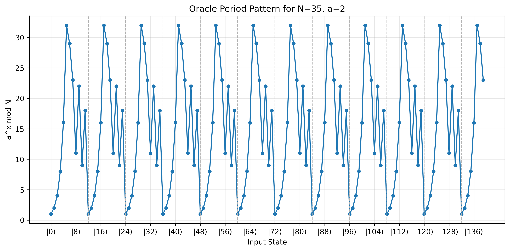
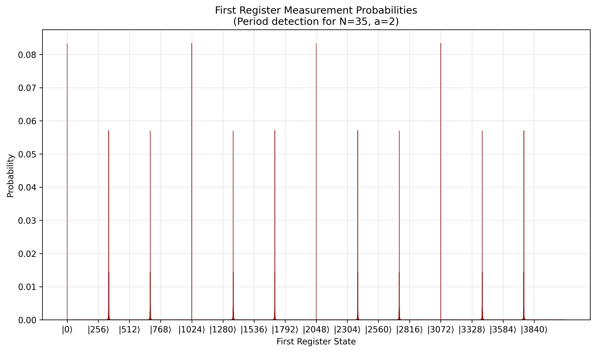
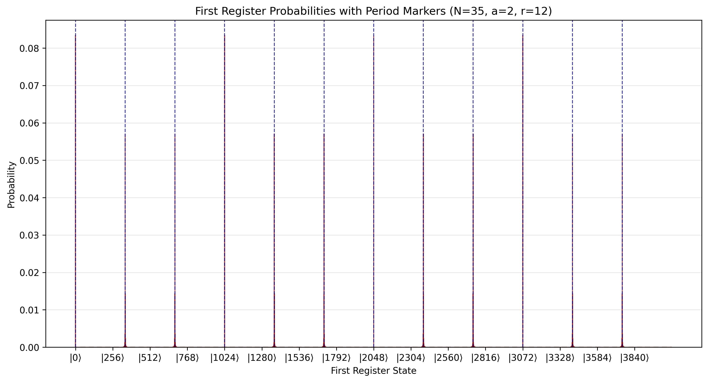
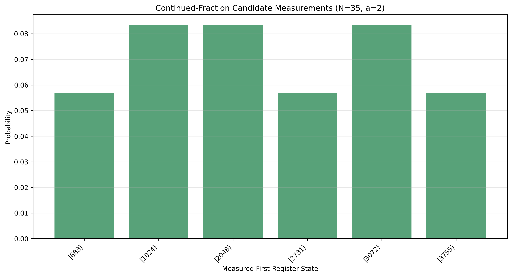
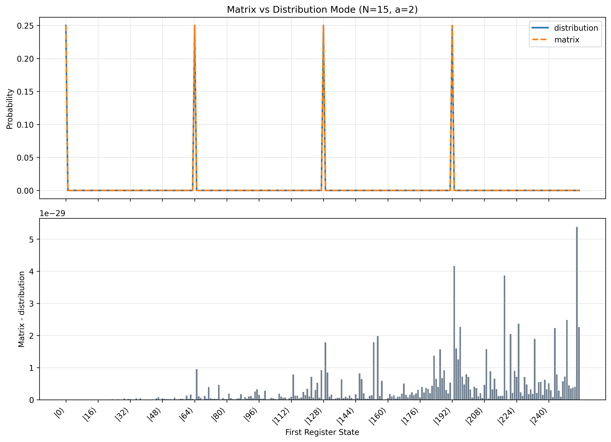
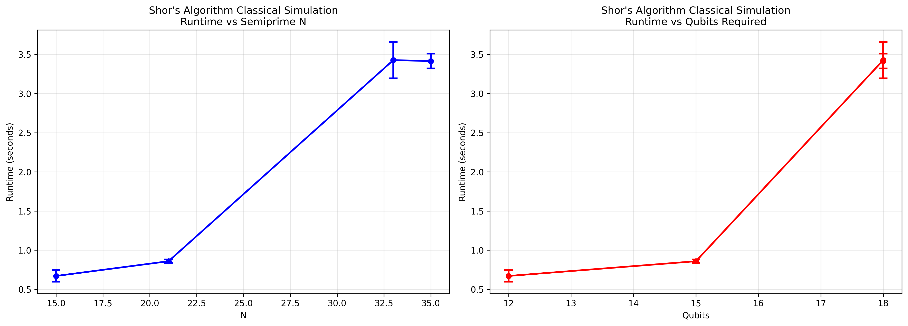

# Results

## Detailed Example: N=35, a=2

For $N=35$ and $a=2$, the multiplicative order of $a \bmod N$ is $r=12$.
This is a useful Shor period because it is even and it produces non-trivial factors in the final classical post-processing step.

The powers of $2 \bmod 35$ repeat after 12 steps:

```
2^0  mod 35 = 1
2^1  mod 35 = 2
2^2  mod 35 = 4
2^3  mod 35 = 8
2^4  mod 35 = 16
2^5  mod 35 = 32
2^6  mod 35 = 29
2^7  mod 35 = 23
2^8  mod 35 = 11
2^9  mod 35 = 22
2^10 mod 35 = 9
2^11 mod 35 = 18
2^12 mod 35 = 1
```

The oracle-period plot shows this hidden periodic function before the IQFT is applied:



Each vertical repeat corresponds to the same modular value appearing again ($12$ peaks corresponding to a period of $12$). This repeated structure is what the quantum Fourier transform converts into measurement peaks.

## First-Register Probability Distribution

For $N=35$, the simulator uses:

```
n = ceil(log2(35)) = 6
Q = 2^(2n) = 4096
```

After the oracle and IQFT, first-register probabilities concentrate near states satisfying:

```
c / Q ~= s / r
```

where `s` is an integer. Since $r=12$, the expected peak spacing is approximately:

```
Q / r = 4096 / 12 = 341.33...
```

So high-probability states should appear near:

```
|0⟩, |341⟩, |683⟩, |1024⟩, |1365⟩, |1707⟩, ...
```



The marked probability plot overlays these expected peak locations for the recovered period:



The peaks are not all exactly equally high because $4096$ is not divisible by $12$. That mismatch is expected: the IQFT concentrates probability near the closest integer states to $sQ/r$, not always exactly on them.

Running:

```python
shors_simulation(N=35, a=2, show_plots=True, sparse=True, mode="distribution")
```

prints:

```
N = 35
Running Classical Checks...
Classical checks passed.
a = 2.
Proceeding to quantum algorithm...
The period r = 12 is even.
a^(r/2) + 1 = 30, and gcd(30, 35) = 5
a^(r/2) - 1 = 28, and gcd(28, 35) = 7
The factors of N = 35 are 5 and 7.
----------------------------------------

Plot saved as: images/first_register_probabilities_N=35_a=2.png
```

The function also returns a structured result dictionary containing the recovered period and factors.

## Continued-Fraction Recovery

The period finder does not count peaks directly. It sorts measurement outcomes by probability, turns each outcome `c` into the fraction `c / Q`, and uses continued fractions to recover denominator candidates.

For $N=35, a=2$, several of the highest-probability measured states immediately point to period candidates related to $12$:

| Measured state | Probability | Continued fraction | Denominator |
| --- | ---: | ---: | ---: |
| `\|341⟩` | `0.056993` | `1/12` | `12` |
| `\|683⟩` | `0.056993` | `1/6` | `6` |
| `\|1024⟩` | `0.083333` | `1/4` | `4` |
| `\|2048⟩` | `0.083333` | `1/2` | `2` |
| `\|3072⟩` | `0.083333` | `3/4` | `4` |
| `\|3755⟩` | `0.056993` | `11/12` | `12` |

Some measured values produce denominators such as `2`, `4`, or `6`, which are divisors of the true period rather than the full period. The implementation therefore tests the denominator and its multiples. In this run, the validated useful period is $r=12$.

A candidate period is accepted only when it can actually produce non-trivial factors:

```
pow(a, r, N) == 1
1 < gcd(a^(r/2) - 1, N) < N
1 < gcd(a^(r/2) + 1, N) < N
```

The diagnostic plot highlights the continued-fraction candidates that lead to an accepted period:



The same diagnostics are also saved as a CSV file:

```
images/continued_fraction_candidates_N=35_a=2.csv
```

## Factor Extraction for N=35, a=2

Once the period is recovered, the final step is entirely classical. Since $r=12$:

```
r / 2 = 6
2^6 = 64
64 mod 35 = 29
```

Now compute:

```
gcd(2^6 - 1, 35) = gcd(63, 35) = gcd(28, 35) = 7
gcd(2^6 + 1, 35) = gcd(65, 35) = gcd(30, 35) = 5
```

So the non-trivial factors are:

```
35 = 5 * 7
```

## Retry Case: N=33, a=2

Some choices of `a` have a valid period but still do not produce non-trivial factors.
For example, $N=33, a=2$ has true order $r=10$, but:

```
2^(10/2) == -1 (mod 33)
```

This makes the factor extraction step trivial, so Shor's algorithm should be retried with a different base.
The simulator now reports this as an expected retry rather than returning incorrect factors.

Using $a=5$ for $N=33$ succeeds and recovers factors $3$ and $11$.

## Additional Visualizations and Mode Comparison

`examples/visualizations_example.py` generates a set of educational plots.

For tiny examples, matrix mode and distribution mode can be compared directly:



The two distributions match up to floating-point error for $N=15, a=2$.

## Runtimes Vs Required Qubits

Running `examples/runtimes_test.py` calls `run_runtime_analysis()` from `src/plots_and_period/runtime_plot.py`.
It measures repeated runtimes for deterministic pairs `(N, a)` known to yield useful periods.

Example cases include:

```
(15, 2)   # 3 * 5
(21, 2)   # 3 * 7
(33, 5)   # 3 * 11
...
(141, 2)  # 3 * 47
(161, 6)  # 7 * 23
```

Runtimes are plotted against $N$ and against the simulated qubit count. Current runtime plots include the simulation mode in the filename.

The checked-in runtime plot below was generated from a short deterministic subset:

```
(15, 2)
(21, 2)
(33, 5)
(35, 2)
```

```
images/runtime_vs_qubit_sparse_True_mode_distribution_repeats_3.png
```



The explicit matrix mode grows quickly because it materializes operators over the full simulated Hilbert space.
Distribution mode is faster because it computes the ideal first-register measurement distribution directly, but it remains a classical educational simulation rather than a scalable factoring implementation.

## References

- [Peter W. Shor, "Polynomial-Time Algorithms for Prime Factorization and Discrete Logarithms on a Quantum Computer" (arXiv)](https://arxiv.org/abs/quant-ph/9508027)
- [IBM Quantum tutorial: Shor's algorithm](https://quantum.cloud.ibm.com/docs/tutorials/shors-algorithm)
- [Python `Fraction.limit_denominator`](https://docs.python.org/3/library/fractions.html#fractions.Fraction.limit_denominator)
- [NumPy inverse FFT](https://numpy.org/doc/stable/reference/generated/numpy.fft.ifft.html)
- [Matplotlib `savefig`](https://matplotlib.org/stable/api/_as_gen/matplotlib.pyplot.savefig.html)

---

## Author

Sid Richards

- LinkedIn: [sid-richards-21374b30b](https://www.linkedin.com/in/sid-richards-21374b30b/)
- GitHub: [SidRichardsQuantum](https://github.com/SidRichardsQuantum)

## License

MIT. See [LICENSE](LICENSE).
