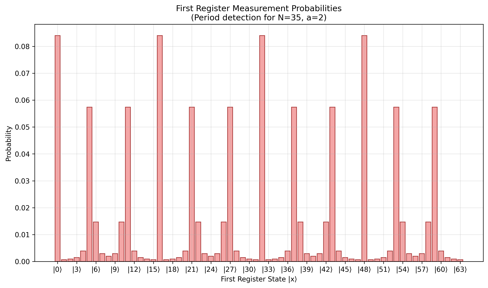
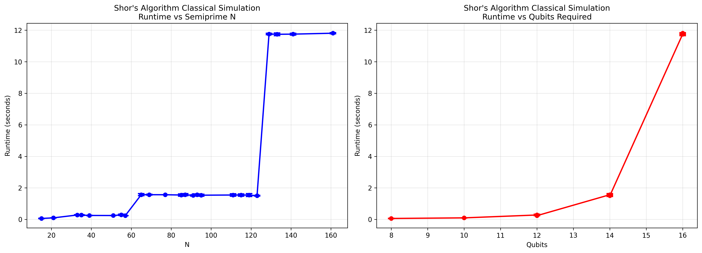

# Results

## State Probabilities

For $N=35$, the total number of qubits required is $12$.
When $a=2$, the period of $a^x \bmod N$ is $r=12$, as seen by the number peaks in the plot below:



In our file ```src/plots_and_period/find_period.py```, the first period candidate is the number of peaks with the maximum probability; $3$ in the image above - which is incorrect.
The second period candidate is then used, which is the number of peaks with probability above the mean - yielding $12$ which is correct.

The output when running ```shors_simulation(N=15, a=7, show_plots=True, sparse=True)``` is:


## Runtimes Vs Required Qubits

Running the file ```examples/runtimes_text.py``` calls the function ```run_runtime_analysis()``` from ```src/plots_and_period/runtime_plot.py```.
This plots the simulation's runtimes for different combinations of $(N, a)$ which are known to yield non-trivial outputs.

```
# List of the form (N, a)
(15, 2),   # 3 * 5, 8 qubits
(21, 2),   # 3 * 7, 10 qubits
              ⋮
(141, 2),  # 3 * 47, 15 qubits
(161, 6),  # 7 * 23, 16 qubits
```

Many runtimes per combination are measured, so the mean can be plotted with error-bars.
Runtimes are plotted against $N$, and again against the number of qubits required.



We can clearly see that the relationship between classical runtime and required qubits is exponential.
A real quantum implementation of Shor's algorithm would factorise semiprimes in polynomial time, even if it takes longer to factorise small semiprimes than classical algorithms.
